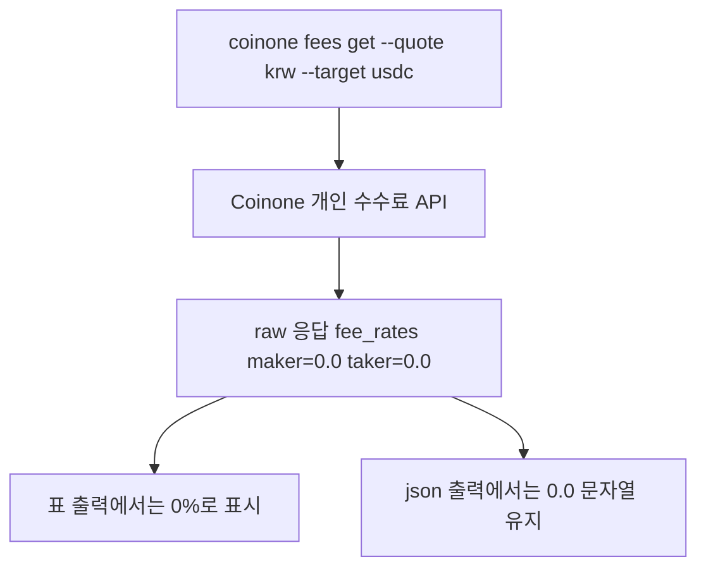

# 인증과 안전장치

코인원 개인 API를 다룰 때는 인증 정보 관리와 실주문 보호 장치가 가장 중요합니다. 명령어 자체는 영어로 유지되지만, 운영 가이드는 한국어 기준으로 읽는 것이 안전합니다.

## 환경 변수

Coinone private API v2.1 요청은 환경 변수 기반 자격 증명으로 서명합니다.

- `COINONE_ACCESS_TOKEN`
- `COINONE_SECRET_KEY`

```bash
export COINONE_ACCESS_TOKEN="your-access-token"
export COINONE_SECRET_KEY="your-secret-key"
coinone doctor
coinone auth status
```

로컬 `.env` 파일에 자격 증명을 저장했다면, 빌드된 CLI를 실행하기 전에 셸에 먼저 로드하세요.

```bash
set -a && source .env && set +a
node dist/bin/coinone.js doctor
```

## 서명 동작

- POST 요청만 사용
- 요청 바디에 `access_token`과 UUID v4 `nonce` 포함
- JSON 바디를 Base64 인코딩해 `X-COINONE-PAYLOAD`에 전달
- payload를 HMAC SHA512로 서명해 `X-COINONE-SIGNATURE`에 전달

## 안전 수칙

- `coinone doctor`는 로컬 설치와 환경만 진단하며 MVP 기준 네트워크가 필요하지 않습니다
- `coinone auth status`는 로컬 환경 변수만 검증하며 Coinone API를 호출하지 않습니다
- 비밀값은 CLI 출력, 예시, 정규화된 JSON에 그대로 노출되지 않습니다
- 비밀값은 셸 환경 변수나 로컬 시크릿 매니저에 저장하고, 명령 히스토리에 직접 남기지 마세요
- `coinone orders place`는 `--dry-run` 또는 `--confirm live` 중 하나가 반드시 필요합니다
- `coinone orders cancel`은 live 전용이며 항상 `--confirm live`가 필요합니다
- 가능하면 모든 실주문 전에 dry run을 먼저 실행하세요
- 저장소 내부에서는 `npm run cli -- <command>` 또는 `node dist/bin/coinone.js <command>`를 사용하고, plain Node로 `src/bin/coinone.ts`를 직접 실행하지 마세요

## 수수료 권한 안내

- `coinone fees list`와 `coinone fees get`는 Coinone 개인 API의 **고객 정보** 권한을 사용합니다
- API 키에 해당 권한이 없으면 Coinone은 `Invalid API permission`과 error code `40`을 반환합니다
- 표 출력은 사람이 읽기 좋게 수수료를 퍼센트로 보여주므로, 원시 값 `"0.0"`은 `0%`로 표시됩니다
- `--json` 출력은 스크립트용 원시 문자열 값을 유지하며, 예를 들어 `"makerFeeRate": "0.0"` 형태를 보존합니다

## 0% 수수료 응답 흐름


