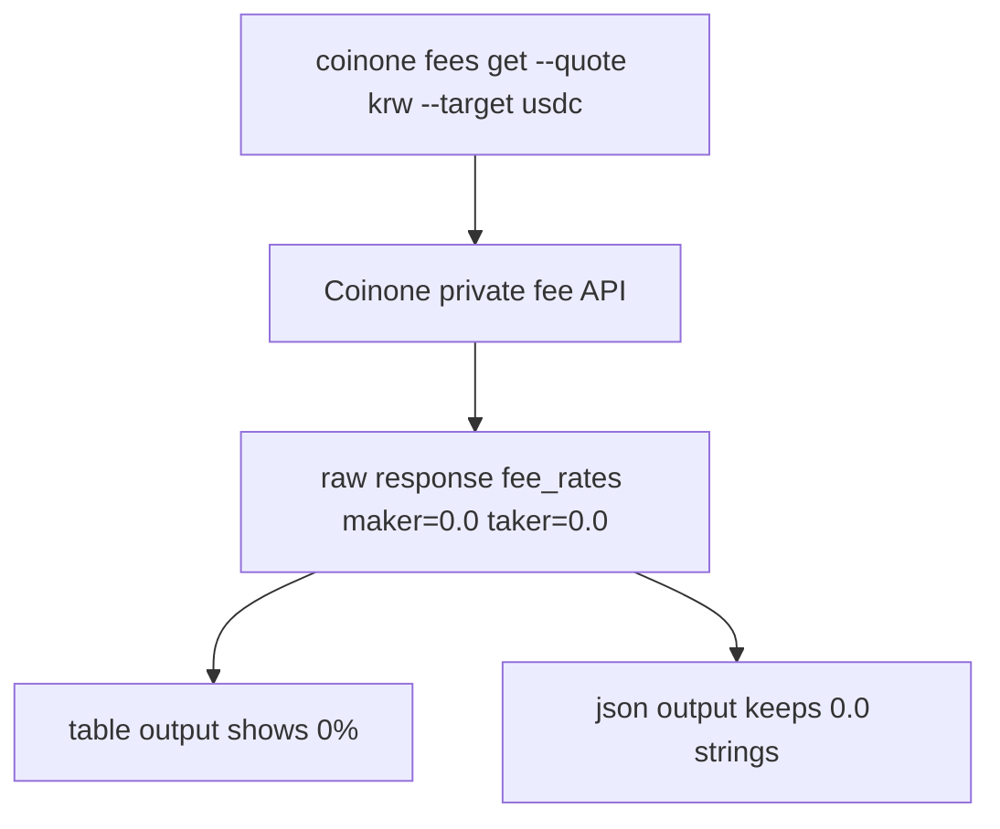

# Auth and Safety

## Environment variables

Coinone private API v2.1 requests are signed with env-based credentials:

- `COINONE_ACCESS_TOKEN`
- `COINONE_SECRET_KEY`

```bash
export COINONE_ACCESS_TOKEN="your-access-token"
export COINONE_SECRET_KEY="your-secret-key"
coinone doctor
coinone auth status
```

If you keep credentials in a local `.env` file, load it into your shell before running the built CLI:

```bash
set -a && source .env && set +a
node dist/bin/coinone.js doctor
```

## Signing behavior

- POST-only requests
- request body includes `access_token` and a UUID v4 `nonce`
- JSON body is Base64 encoded into `X-COINONE-PAYLOAD`
- payload is signed with HMAC SHA512 into `X-COINONE-SIGNATURE`

## Safety notes

- `coinone doctor` is local-only install and env diagnostics; it never needs network access for the MVP
- `coinone auth status` only validates local env configuration; it does not need to call Coinone
- secrets are never echoed in CLI output, examples, or normalized JSON
- prefer shell env vars or a local secret manager; do not put secrets directly in command history
- `coinone orders place` requires either `--dry-run` or `--confirm live`
- `coinone orders cancel` is live-only and always requires `--confirm live`
- run a dry run before any live order placement whenever possible
- when working inside the repo, prefer `npm run cli -- <command>` or `node dist/bin/coinone.js <command>`; do not run `node src/bin/coinone.ts` directly with plain Node

## Fee permission note

- `coinone fees list` and `coinone fees get` use Coinone private API permissions under **고객 정보**
- if your API key does not include that permission, Coinone returns `Invalid API permission` with error code `40`
- table output shows fee rates as percentages for humans, so a raw API value like `"0.0"` is displayed as `0%`
- `--json` keeps the normalized raw string values for scripting, for example `"makerFeeRate": "0.0"`

## Zero-fee response flow


