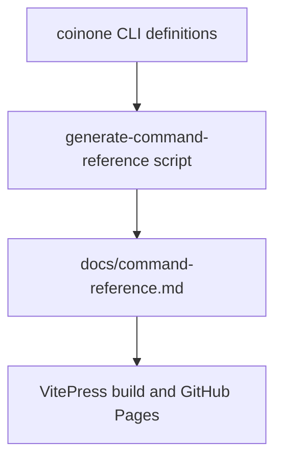

# Command Reference

> [!IMPORTANT]
> This file is generated from the live CLI command tree. Do not edit it by hand.
> Refresh it with `npm run docs:generate-reference`.

## Generation flow



## Overview

- generated from `createCli()` so command docs follow the shipped CLI structure
- includes root help plus nested subcommand help blocks
- excludes the built-in Commander `help` command from navigation sections

## `coinone`
```text
Usage: coinone [options] [command]

Developer-friendly CLI for Coinone public and private APIs

Options:
  -V, --version     output the version number
  --json            Output normalized JSON
  --output <mode>   Output mode: table, json, raw (default: "table")
  --color           Force color output when printing errors
  --base-url <url>  Override the Coinone API base URL
  --timeout <ms>    Set request timeout in milliseconds
  -h, --help        display help for command

Commands:
  doctor            Inspect local install and runtime setup without calling
                    Coinone
  auth              Inspect private API auth configuration
  balances          Query authenticated account balances
  markets           Query market metadata
  currencies        Query currency metadata
  fees              Query authenticated trade fee data
  orders            Query authenticated order data and submit guarded order
                    actions
  ticker            Query ticker data
  orderbook         Query orderbook data
  trades            Query recent trade history
  range-units       Query price range units
  help [command]    display help for command
```

Subcommands:
- `coinone doctor`
- `coinone auth`
- `coinone balances`
- `coinone markets`
- `coinone currencies`
- `coinone fees`
- `coinone orders`
- `coinone ticker`
- `coinone orderbook`
- `coinone trades`
- `coinone range-units`

### `coinone doctor`
```text
Usage: coinone doctor [options]

Inspect local install and runtime setup without calling Coinone

Options:
  -h, --help  display help for command
```

### `coinone auth`
```text
Usage: coinone auth [options] [command]

Inspect private API auth configuration

Options:
  -h, --help      display help for command

Commands:
  status          Validate local auth env vars without calling the API
  help [command]  display help for command
```

Subcommands:
- `coinone auth status`

#### `coinone auth status`
```text
Usage: coinone auth status [options]

Validate local auth env vars without calling the API

Options:
  -h, --help  display help for command
```

### `coinone balances`
```text
Usage: coinone balances [options] [command]

Query authenticated account balances

Options:
  -h, --help      display help for command

Commands:
  list            List balances for the authenticated account
  get <currency>  Get one balance by currency
  help [command]  display help for command
```

Subcommands:
- `coinone balances list`
- `coinone balances get`

#### `coinone balances list`
```text
Usage: coinone balances list [options]

List balances for the authenticated account

Options:
  -h, --help  display help for command
```

#### `coinone balances get`
```text
Usage: coinone balances get [options] <currency>

Get one balance by currency

Arguments:
  currency    Currency symbol, for example BTC

Options:
  -h, --help  display help for command
```

### `coinone markets`
```text
Usage: coinone markets [options] [command]

Query market metadata

Options:
  -h, --help                      display help for command

Commands:
  list                            List markets for the default KRW quote
                                  currency
  get [options] <targetCurrency>  Get market metadata for one trading pair
  help [command]                  display help for command
```

Subcommands:
- `coinone markets list`
- `coinone markets get`

#### `coinone markets list`
```text
Usage: coinone markets list [options]

List markets for the default KRW quote currency

Options:
  -h, --help  display help for command
```

#### `coinone markets get`
```text
Usage: coinone markets get [options] <targetCurrency>

Get market metadata for one trading pair

Arguments:
  targetCurrency           Target currency symbol, for example BTC

Options:
  --quote <quoteCurrency>  Quote currency, for example KRW
  -h, --help               display help for command
```

### `coinone currencies`
```text
Usage: coinone currencies [options] [command]

Query currency metadata

Options:
  -h, --help      display help for command

Commands:
  list            List supported currencies
  get <currency>  Get metadata for one currency
  help [command]  display help for command
```

Subcommands:
- `coinone currencies list`
- `coinone currencies get`

#### `coinone currencies list`
```text
Usage: coinone currencies list [options]

List supported currencies

Options:
  -h, --help  display help for command
```

#### `coinone currencies get`
```text
Usage: coinone currencies get [options] <currency>

Get metadata for one currency

Arguments:
  currency    Currency symbol, for example BTC

Options:
  -h, --help  display help for command
```

### `coinone fees`
```text
Usage: coinone fees [options] [command]

Query authenticated trade fee data

Options:
  -h, --help      display help for command

Commands:
  list            List trade fees for the authenticated account
  get [options]   Get trade fee for one market pair
  help [command]  display help for command
```

Subcommands:
- `coinone fees list`
- `coinone fees get`

#### `coinone fees list`
```text
Usage: coinone fees list [options]

List trade fees for the authenticated account

Options:
  -h, --help  display help for command
```

#### `coinone fees get`
```text
Usage: coinone fees get [options]

Get trade fee for one market pair

Options:
  --quote <quoteCurrency>    Quote currency, for example KRW
  --target <targetCurrency>  Target currency, for example BTC
  -h, --help                 display help for command
```

### `coinone orders`
```text
Usage: coinone orders [options] [command]

Query authenticated order data and submit guarded order actions

Options:
  -h, --help               display help for command

Commands:
  active [options]         List active orders with optional filters
  get [options] <orderId>  Get one order detail by order id and market pair
  place [options]          Place a guarded private limit order
  cancel [options]         Cancel an order with explicit live confirmation
  completed [options]      List completed orders for a time window
  help [command]           display help for command
```

Subcommands:
- `coinone orders active`
- `coinone orders get`
- `coinone orders place`
- `coinone orders cancel`
- `coinone orders completed`

#### `coinone orders active`
```text
Usage: coinone orders active [options]

List active orders with optional filters

Options:
  --quote <quoteCurrency>    Quote currency, for example KRW
  --target <targetCurrency>  Target currency, for example BTC
  --type <type>              Order type filter; repeat or pass comma-separated
                             values (default: [])
  -h, --help                 display help for command
```

#### `coinone orders get`
```text
Usage: coinone orders get [options] <orderId>

Get one order detail by order id and market pair

Arguments:
  orderId                    Coinone order id

Options:
  --quote <quoteCurrency>    Quote currency, for example KRW
  --target <targetCurrency>  Target currency, for example BTC
  --user-order-id <id>       Optional user-provided order id filter
  -h, --help                 display help for command
```

#### `coinone orders place`
```text
Usage: coinone orders place [options]

Place a guarded private limit order

Options:
  --quote <quoteCurrency>    Quote currency, for example KRW
  --target <targetCurrency>  Target currency, for example BTC
  --side <buy|sell>          Order side: buy or sell
  --type <type>              Order type; MVP currently supports limit only
  --price <string>           Limit price as a decimal string
  --qty <string>             Order quantity as a decimal string
  --post-only                Submit the order as post-only
  --user-order-id <id>       Optional user-provided order id
  --dry-run                  Validate locally only; do not call Coinone
  --confirm <mode>           Required for live submission; use `live`
  -h, --help                 display help for command
```

#### `coinone orders cancel`
```text
Usage: coinone orders cancel [options]

Cancel an order with explicit live confirmation

Options:
  --order-id <id>            Coinone order id to cancel
  --quote <quoteCurrency>    Quote currency, for example KRW
  --target <targetCurrency>  Target currency, for example BTC
  --confirm <mode>           Required for live cancel; use `live`
  --user-order-id <id>       Optional user-provided order id
  -h, --help                 display help for command
```

#### `coinone orders completed`
```text
Usage: coinone orders completed [options]

List completed orders for a time window

Options:
  --from <timestampMsOrIso>  Window start in UTC milliseconds or ISO-8601
  --to <timestampMsOrIso>    Window end in UTC milliseconds or ISO-8601
  --size <n>                 Number of completed orders to return (1-100)
                             (default: 50)
  --to-trade-id <id>         Cursor to continue from an older trade id
  --quote <quoteCurrency>    Quote currency, for example KRW
  --target <targetCurrency>  Target currency, for example BTC
  -h, --help                 display help for command
```

### `coinone ticker`
```text
Usage: coinone ticker [options] [command]

Query ticker data

Options:
  -h, --help                      display help for command

Commands:
  list [options]                  List tickers for a quote currency
  get [options] <targetCurrency>  Get ticker data for one trading pair
  help [command]                  display help for command
```

Subcommands:
- `coinone ticker list`
- `coinone ticker get`

#### `coinone ticker list`
```text
Usage: coinone ticker list [options]

List tickers for a quote currency

Options:
  --quote <quoteCurrency>  Quote currency, defaults to KRW
  -h, --help               display help for command
```

#### `coinone ticker get`
```text
Usage: coinone ticker get [options] <targetCurrency>

Get ticker data for one trading pair

Arguments:
  targetCurrency           Target currency symbol, for example BTC

Options:
  --quote <quoteCurrency>  Quote currency, for example KRW
  -h, --help               display help for command
```

### `coinone orderbook`
```text
Usage: coinone orderbook [options] [command]

Query orderbook data

Options:
  -h, --help                      display help for command

Commands:
  get [options] <targetCurrency>  Get orderbook for one trading pair
  help [command]                  display help for command
```

Subcommands:
- `coinone orderbook get`

#### `coinone orderbook get`
```text
Usage: coinone orderbook get [options] <targetCurrency>

Get orderbook for one trading pair

Arguments:
  targetCurrency           Target currency symbol, for example BTC

Options:
  --quote <quoteCurrency>  Quote currency, for example KRW
  --size <n>               Depth size: 5, 10, 15, or 16
  -h, --help               display help for command
```

### `coinone trades`
```text
Usage: coinone trades [options] [command]

Query recent trade history

Options:
  -h, --help                       display help for command

Commands:
  list [options] <targetCurrency>  List recent completed trades for one trading
                                   pair
  help [command]                   display help for command
```

Subcommands:
- `coinone trades list`

#### `coinone trades list`
```text
Usage: coinone trades list [options] <targetCurrency>

List recent completed trades for one trading pair

Arguments:
  targetCurrency           Target currency symbol, for example BTC

Options:
  --quote <quoteCurrency>  Quote currency, for example KRW
  --size <n>               Number of trades: 10, 50, 100, 150, or 200
  -h, --help               display help for command
```

### `coinone range-units`
```text
Usage: coinone range-units [options] [command]

Query price range units

Options:
  -h, --help                      display help for command

Commands:
  get [options] <targetCurrency>  Get range units for one trading pair
  help [command]                  display help for command
```

Subcommands:
- `coinone range-units get`

#### `coinone range-units get`
```text
Usage: coinone range-units get [options] <targetCurrency>

Get range units for one trading pair

Arguments:
  targetCurrency           Target currency symbol, for example BTC

Options:
  --quote <quoteCurrency>  Quote currency, for example KRW
  -h, --help               display help for command
```
