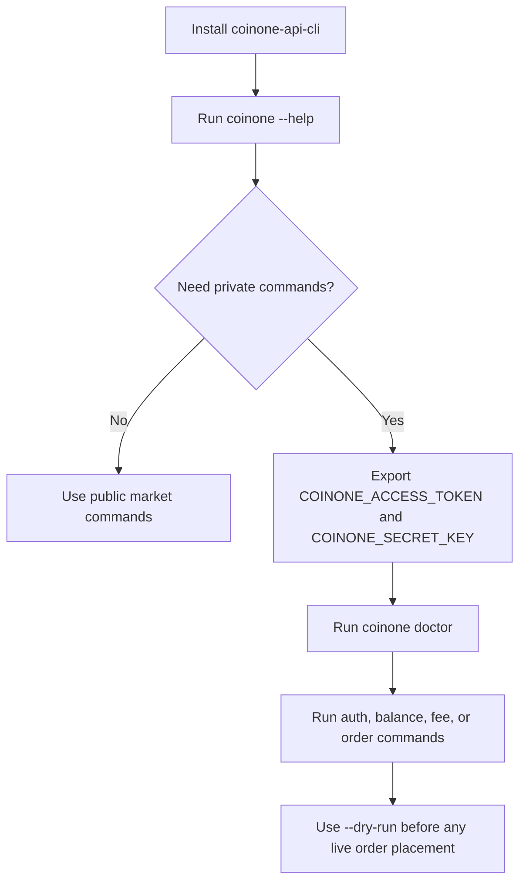

## What this CLI covers

- public market data: markets, currencies, ticker, orderbook, trades, range units
- private read workflows: auth status, balances, fees, order lookup, order history
- guarded private writes: place and cancel orders with explicit safety flags

## User flow



## Start here

- [Install](./install): npm, Homebrew, Git install, and local development paths
- [Quickstart](./quickstart): copy-paste command examples for common tasks
- [Commands](./commands): quick command overview and notable behavior
- [Command Reference](./command-reference): generated from the live CLI command tree
- [Auth and Safety](./auth-and-safety): environment setup, signing behavior, and live-order safeguards
- [Output and Automation](./output-and-automation): `--json`, `--output raw`, timeouts, and shell scripting patterns
- [Troubleshooting](./troubleshooting): install, PATH, auth, and command validation tips

## Local docs commands

```bash
npm install
npm run docs:dev
npm run docs:build
npm run docs:preview
```
