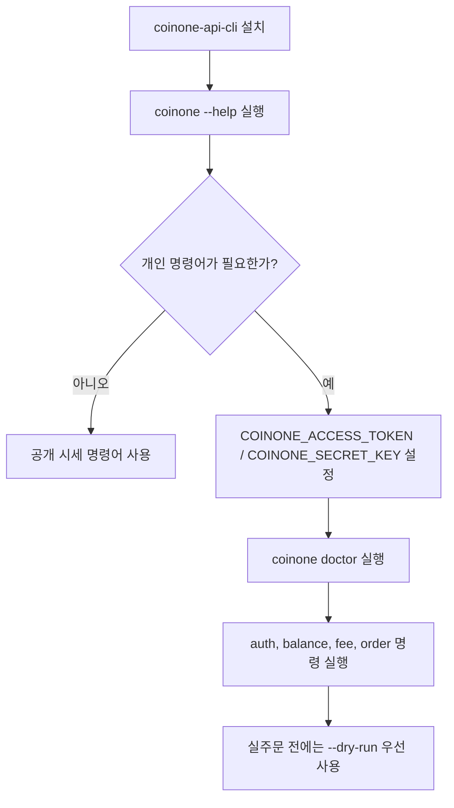

## 이 CLI로 할 수 있는 일

- 공개 시세 조회: markets, currencies, ticker, orderbook, trades, range units
- 개인 조회 작업: auth status, balances, fees, 주문 조회, 주문 이력 확인
- 보호된 주문 작업: 명시적 안전 플래그가 필요한 주문 생성 및 취소

## 기본 사용 흐름



## 먼저 읽으면 좋은 문서

- [설치](./install): npm, Homebrew, Git 설치와 로컬 개발 경로
- [빠른 시작](./quickstart): 바로 복사해서 실행할 수 있는 예시
- [명령어 개요](./commands): 주요 명령 그룹과 주의할 동작 정리
- [명령어 레퍼런스](./command-reference): 실제 CLI 명령 트리에서 자동 생성된 문서
- [인증과 안전장치](./auth-and-safety): 환경 변수 설정, 서명 방식, 실주문 안전장치
- [출력과 자동화](./output-and-automation): `--json`, `--output raw`, timeout, 쉘 자동화 패턴
- [문제 해결](./troubleshooting): 설치, PATH, 인증, 검증 실패 대응 팁

## 로컬 문서 명령어

```bash
npm install
npm run docs:dev
npm run docs:build
npm run docs:preview
```
