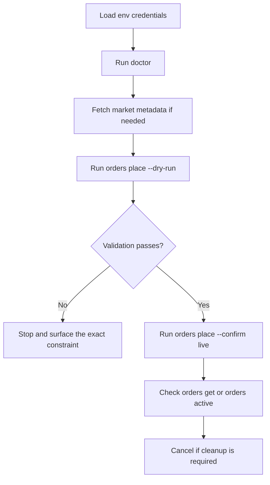

# Quickstart

## Public market data

```bash
coinone markets list
coinone ticker get btc --quote krw
coinone trades list btc --quote krw --size 50 --json
coinone orderbook get btc --quote krw --size 10
```

## Private read-only commands

```bash
export COINONE_ACCESS_TOKEN="your-access-token"
export COINONE_SECRET_KEY="your-secret-key"

coinone doctor
coinone auth status
coinone balances list
coinone fees get --quote krw --target btc
coinone orders completed --from 2026-01-01T00:00:00Z --to 2026-01-02T00:00:00Z --json
```

## Private order writes with safety rails

`orders place --confirm live` and `orders cancel --confirm live` can trigger real account changes immediately. Prefer `--dry-run` first.

```bash
# local validation only; no Coinone request is sent
coinone orders place --quote krw --target btc --side buy --type limit --price 1000 --qty 0.01 --dry-run

# real submission; requires explicit confirmation
coinone orders place --quote krw --target btc --side buy --type limit --price 1000 --qty 0.01 --confirm live

# optional post-only limit order
coinone orders place --quote krw --target btc --side sell --type limit --price 1200 --qty 0.01 --post-only --confirm live

# real cancellation; live-only in the MVP
coinone orders cancel --order-id 12345 --quote krw --target btc --confirm live
```

## Script-friendly examples

```bash
coinone doctor --json
coinone --json ticker get btc --quote krw
coinone --timeout 10000 ticker list --quote krw --json
coinone --base-url http://127.0.0.1:4010 --json markets get btc --quote krw
```

```bash
last_price=$(coinone --json ticker get btc --quote krw | jq -r '.last')
echo "$last_price"
```

## Recommended private workflow


