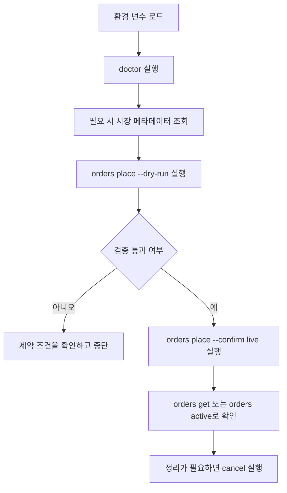

# 빠른 시작

## 공개 시세 데이터 조회

```bash
coinone markets list
coinone ticker get btc --quote krw
coinone trades list btc --quote krw --size 50 --json
coinone orderbook get btc --quote krw --size 10
```

## 개인 조회 전용 명령어

```bash
export COINONE_ACCESS_TOKEN="your-access-token"
export COINONE_SECRET_KEY="your-secret-key"

coinone doctor
coinone auth status
coinone balances list
coinone fees get --quote krw --target btc
coinone orders completed --from 2026-01-01T00:00:00Z --to 2026-01-02T00:00:00Z --json
```

## 안전장치가 있는 개인 주문 명령

`orders place --confirm live`와 `orders cancel --confirm live`는 실제 계정 상태를 즉시 바꿀 수 있습니다. 먼저 `--dry-run`으로 검증하는 것을 권장합니다.

```bash
# 로컬 검증만 수행하며 Coinone 요청은 보내지 않음
coinone orders place --quote krw --target btc --side buy --type limit --price 1000 --qty 0.01 --dry-run

# 실제 주문 전송, 명시적 확인 필요
coinone orders place --quote krw --target btc --side buy --type limit --price 1000 --qty 0.01 --confirm live

# 선택적 post-only 지정가 주문
coinone orders place --quote krw --target btc --side sell --type limit --price 1200 --qty 0.01 --post-only --confirm live

# 실제 취소, 현재 MVP에서는 live 확인 필수
coinone orders cancel --order-id 12345 --quote krw --target btc --confirm live
```

## 자동화 친화적인 예시

```bash
coinone doctor --json
coinone --json ticker get btc --quote krw
coinone --timeout 10000 ticker list --quote krw --json
coinone --base-url http://127.0.0.1:4010 --json markets get btc --quote krw
```

```bash
last_price=$(coinone --json ticker get btc --quote krw | jq -r '.last')
echo "$last_price"
```

## 권장 개인 API 사용 흐름


